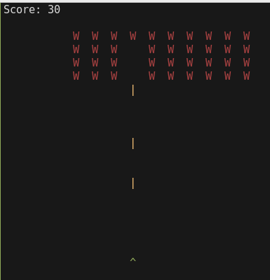

# Space Invaders (Text‑Based)

## The Human's Overview

This is a test to see how complete the OpenCode vibe-coding experience is versus the $200++/year ClaudeCode experience.

This last year I purchased a 16GB GPU and wanted to see just what could be pulled off running a local LLM.

I gotta say I am pleasently surprised.



ClaudeCode is obviously the diamond experience.  It can write the code, validate it, test it, and fix it's own errors.

Using LM Studio, I can load models upto about the 14 billion parameter mark and have them be very fast, but LM Studio also affords me the ability to run models that do not fit within the GPU's memory, then "swap" the left over onto system memory and CPU.

Since churning out 100s of lines of code per second was not goal here, I'm fine with the ~30 tokens per second that I was getting on my setup which is:
  - Ubuntu Linux using an RTX 5070 with 16GB of VRAM 
  - OpenCode
  - LM Studio running "openai/gpt-oss-20b"

This vibing session took about 30 minutes to produce the working game, which could be greatly improved upon, but is at least a running, text-based version of the classic arcade game Space Invaders written in Golang.

I did have to prompt and tackle a few bugs.  Each attempt by opencode and the model to fix a given error seemed to take about 5 minutes or so which isn't great, but given that this is basically just desktop PC with a decent gaming card, it's not bad either.

I tried a few other models and was hopeful for 'qwen3-8b', but the Go that Qwen produced kept having basic errors and it seemed to insist on using external libraries, which really shouldn't have been necessary.  I supposed I should have been more explicit.

Here was my initial prompt:

    Code for me a fully working text-based version of the classic arcade game Space Invaders in which I can use the left and right arrow keys to move the players ship and shoot at rows of descending attacking ships in Golang.  I want to be able to lunch and play the game by simply executing "go run main.go" without needing to use image files of any kind.

That $0 spent is the cherry on top:

    Context
    25,824 tokens
    20% used
    $0.00 spent


- RoboJandro

----

This is a minimal, terminal‑only clone of the classic *Space Invaders* arcade game written in Go.

## Requirements
- Go 1.22+ (any recent stable release works).
- A terminal that supports ANSI escape codes (Linux/macOS terminals, Windows Terminal or PowerShell with `Set-ItemProperty` enabled). The program uses the [termbox‑go](https://github.com/nsf/termbox-go) library for rendering.

## Building & Running
```bash
# Clone or download this repository
git clone https://github.com/yourname/spaceinvaders.git   # optional if you already have the files
cd spaceinvaders

# Run directly (no build step needed)
go run main.go
```

The game starts immediately. No additional setup is required.

## Controls
| Key | Action |
|-----|--------|
| Left Arrow  | Move ship left |
| Right Arrow | Move ship right |
| Spacebar    | Shoot a bullet |
| Esc         | Quit the game |

The ship (`^`) starts near the bottom center of the screen. Aliens (`W`) descend from the top in rows and move horizontally. Destroy them with bullets to earn points (each alien is worth 10). If an alien reaches your row, you lose.

## Game Loop
- **Game state**: player, aliens, bullets, score, tick counter.
- **Rendering**: each frame clears the screen and draws all live entities.
- **Input handling**: a goroutine feeds terminal events into a channel; the main loop selects between input events and a 50 ms ticker that updates game logic.

## Customization
Feel free to tweak the constants in `main.go`:
```go
width, height = 40, 20   // screen size
tickInterval  = 50 * time.Millisecond
```
You can also change alien speed or starting positions by editing the loops in `newGame()`.

## License
This project is released under the MIT license. Feel free to use, modify, and distribute.
